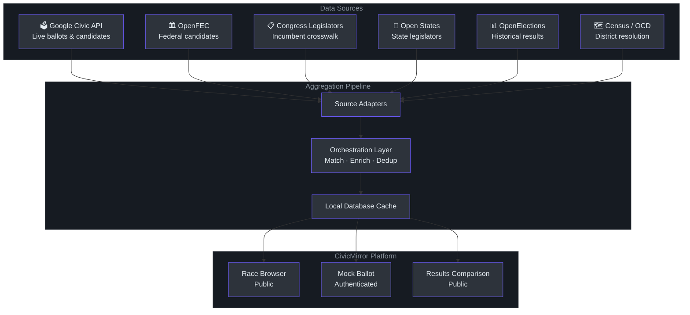
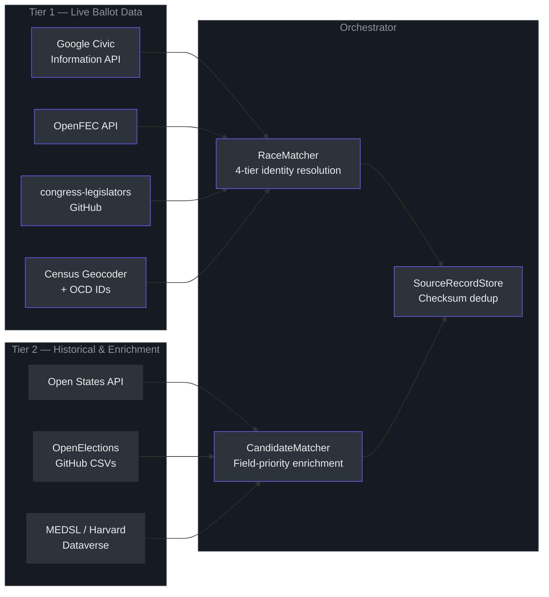
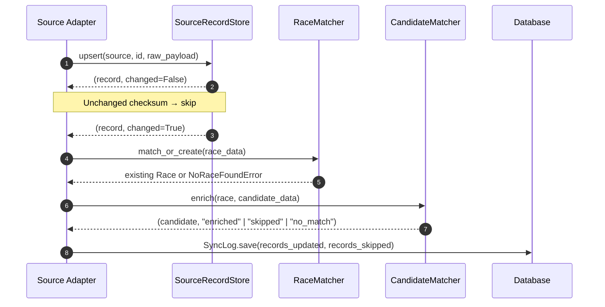
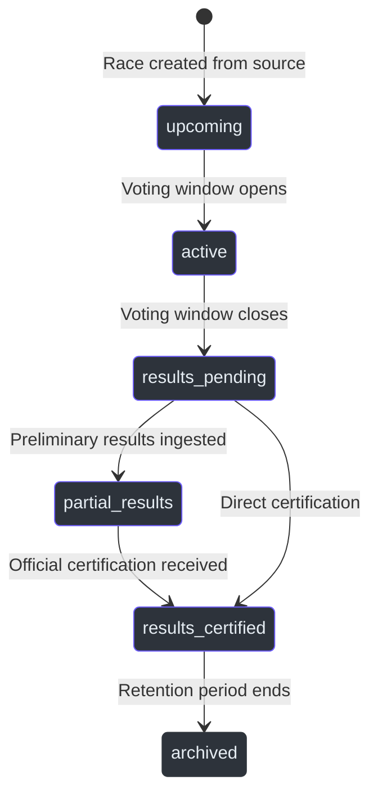

# CivicMirror

> **Informational and educational purposes only.** Mock votes cast here have no legal effect and do not influence real election outcomes. CivicMirror is not affiliated with any government agency, election authority, or political organization.

CivicMirror is an open civic engagement platform that imports real election data — candidates, races, ballot measures, and official results — and allows anyone on the internet to cast a mock vote, regardless of age, citizenship, or country of residence. After official results are certified, the platform compares mock vote outcomes against real-world results, surfacing an unrestricted "internet public opinion" dataset alongside the official record.

**Core research question:** *When all eligibility restrictions are removed, how closely does open internet opinion reflect the choices of eligible voters?*

---

## What CivicMirror Does

---

## Platform Features

### Browse Races — No Account Required

The full race browser is public. Any visitor can:

- Filter races by **National**, **State**, or local scope
- View candidate names, parties, incumbency status, and office details
- See live mock vote tallies for any race in real time
- Read official certified results once an election has concluded
- Compare mock vote outcomes against the real result side-by-side

(`frontend/src/pages/RaceDetailPage.tsx` — `RaceDetailPage` component)

### Cast a Mock Vote — Registered Users

Registered users gain ballot access after a lightweight sign-up with no email verification required. One mock vote per race, no changes after submission — mirroring the irreversibility of real ballots.

(`backend/voting/models.py` — `MockVote` model with `unique_user_race_vote` database constraint)

### Add a Local Race — Community Contribution

Where no data source covers a local race, verified users can submit it through a guided wizard. Community-contributed races are clearly labeled and flagged for admin review if errors are reported.

(`backend/elections/models.py` — `Race.Source.COMMUNITY`)

---

## Elections and Races

CivicMirror distinguishes between two related but distinct concepts:

| Concept | Definition | Example |
|---|---|---|
| **Election** | Administrative container: a date, jurisdiction, and label | *2026 Massachusetts General Election* |
| **Race** | The voteable unit: a specific office and its candidates | *U.S. Senate — MA, 2026* |

A single election contains dozens to hundreds of races. All voting, tallying, and result comparison logic operates at the **race** level. Races come in two types:

- **Candidate race** — named candidates competing for a single office
- **Ballot measure** — a yes/no question put to voters

(`backend/elections/models.py` — `Election`, `Race`, `Race.RaceType`)

---

## Data Sources

CivicMirror aggregates data from multiple free and open sources. Each source feeds a dedicated adapter that normalizes data before it reaches the shared orchestration layer.

### Google Civic Information API

The **primary live ballot source**. Provides upcoming elections, race/contest listings, candidate names and parties, ballot measure text, and polling location data for federal and many state and local jurisdictions.

- Coverage: Federal + most state elections; local varies by jurisdiction
- Update cadence: Near-live, synced every hour via scheduled background task
- Access: REST/JSON with API key (free, 25,000 requests/day)
- Reference: [Google Civic Information API](https://developers.google.com/civic-information)

(`backend/integrations/civic/` — existing primary integration)

---

### OpenFEC API

The **federal candidate enrichment source**. Supplies FEC candidate IDs, office and district assignments, party affiliation, and incumbent/challenger status for all registered federal candidates.

- Coverage: Federal candidates only (U.S. House, Senate, President)
- Update cadence: Nightly background sync per election cycle
- Access: REST/JSON with API key (free, 1,000 requests/hour)
- Reference: [api.open.fec.gov](https://api.open.fec.gov/developers/)

(`backend/integrations/fec/` — `sync_fec_candidates` Celery task)

---

### congress-legislators

A community-maintained dataset of current and historical members of Congress, published by the [United States project](https://github.com/unitedstates/congress-legislators). Provides biographical detail, contact information, office addresses, FEC cross-reference IDs, and social media handles for federal incumbents.

- Coverage: Current and historical U.S. Congress members
- Update cadence: Weekly sync via ETag-cached GitHub download (no rate limit)
- Access: JSON/YAML direct download, no key required
- Reference: [github.com/unitedstates/congress-legislators](https://github.com/unitedstates/congress-legislators)

(`backend/integrations/congress/` — `sync_congress_legislators` Celery task)

---

### Open States API

The **state-level incumbent enrichment source**. Provides state legislator records including party, chamber, district, contact details, and official images for all 50 states.

- Coverage: All 50 U.S. state legislatures
- Update cadence: Nightly per-state sync, fan-out with rate-limit spacing
- Access: REST/JSON with API key (free tier, 500 requests/day)
- Reference: [v3.openstates.org](https://v3.openstates.org/) · [docs.openstates.org](https://docs.openstates.org/api-v3/)

(`backend/integrations/openstates/` — `sync_openstates_all_states` Celery fan-out task)

---

### OpenElections

A volunteer-run project that aggregates certified election results from every U.S. state, stored as standardized CSV files in per-state GitHub repositories. CivicMirror uses OpenElections to populate historical `OfficialResult` records and to update race certification status after election day.

- Coverage: Historical certified results across most states; precinct-level where available
- Update cadence: Weekly scan for newly committed result files
- Access: GitHub raw CSV download; authenticated with `GITHUB_TOKEN` for higher rate limits
- Reference: [openelections.net](https://openelections.net) · [github.com/openelections](https://github.com/openelections)

(`backend/integrations/openelections/` — `check_openelections_new_results` and `ingest_openelections_state` tasks)

---

### MEDSL / MIT Election Data and Science Lab

The Harvard Dataverse hosts the MIT Election Data and Science Lab's returns dataset — a research-grade archive of official election returns spanning decades of federal, state, and local races. Used for long-range historical result backfill and validation.

- Coverage: Broad historical federal and state-level returns
- Update cadence: Post-election batch import (manual trigger)
- Access: CSV bulk download, no key required
- Reference: [electionlab.mit.edu/data](https://electionlab.mit.edu/data)

(Deferred to future phase; `Race.Source.MEDSL` enumeration reserved in `elections/models.py`)

---

### U.S. Census Geocoder and Open Civic Data Division IDs

The **geographic normalization layer**. The Census Geocoder resolves addresses and ZIP codes to congressional districts, counties, and FIPS codes. Open Civic Data (OCD) division IDs provide the shared identifier vocabulary that links the same real-world jurisdiction across all source systems.

- Coverage: National
- Update cadence: Monthly district record refresh; OCD ID reference cached 7 days
- Access: REST geocoder, no key required; OCD IDs from public GitHub CSV
- Reference: [geocoding.geo.census.gov](https://geocoding.geo.census.gov) · [github.com/opencivicdata/ocd-division-ids](https://github.com/opencivicdata/ocd-division-ids)

(`backend/integrations/census/resolver.py` — `resolve_ocd_id`, `resolve_address`, `resolve_zip`)

---

## How Data is Aggregated

All sources feed through a shared orchestration layer that prevents duplication across sources and enforces provenance rules.

**Key rules enforced by the orchestrator:**

- `Candidate.name` is **immutable** from all enrichment sources — only the primary Civic API sets the displayed name
- Field-level source priority: `Google Civic > FEC > congress-legislators > Open States > OpenElections`
- Enrichment sources (FEC, congress, Open States) never create new `Race` records — they only enrich existing ones
- Every raw payload is stored in `SourceRecord` with a SHA-256 checksum; unchanged records are skipped on every sync

(`backend/integrations/orchestrator/` — `RaceMatcher`, `CandidateMatcher`, `EnrichmentMerger`, `SourceRecordStore`)

---

## User Tiers

| Capability | Public (no account) | Registered User |
|---|---|---|
| Browse races | ✅ | ✅ |
| View live mock tallies | ✅ | ✅ |
| View official results | ✅ | ✅ |
| Cast a mock vote | ❌ | ✅ (once per race) |
| View personal vote history | ❌ | ✅ |
| Submit a local race | ❌ | ✅ |
| Report a race error | ❌ | ✅ |

Registration requires only a username and password — no email verification, no proof of identity, no eligibility check. This is by design: the research value of the platform depends on truly open participation.

(`backend/accounts/` — user registration and profile; `backend/voting/models.py` — `MockVote`)

---

## Sync Schedule

| Task | Schedule | Source |
|---|---|---|
| Live election & race sync | Every hour | Google Civic API |
| Federal candidate enrichment | Nightly 2 AM UTC | OpenFEC |
| Congress legislator enrichment | Weekly Sunday 3 AM UTC | congress-legislators |
| State legislator enrichment | Nightly 4 AM UTC (all 50 states) | Open States |
| District record refresh | Monthly, 1st of month | Census Geocoder |
| OpenElections result detection | Weekly Saturday midnight UTC | OpenElections GitHub |

(`backend/config/celery.py` — `app.conf.beat_schedule`)

---

## Race Status Lifecycle

(`backend/elections/models.py` — `Race.CertificationStatus`, `Election.Status`)

---

## Tech Stack

| Layer | Technology |
|---|---|
| Backend | Django + Django REST Framework |
| Background tasks | Celery + Redis |
| Database | PostgreSQL |
| Frontend | React + Vite + Material UI v7 |
| State management | Zustand |
| Deployment | Google Cloud Run |

---

## Disclaimer

*CivicMirror is an informational and educational tool. Mock votes have no legal effect and do not influence real elections. This platform is not affiliated with any government agency, election authority, or political organization. Official election results displayed here are sourced from public records and provided for reference only.*

---

## License

See [LICENSE](LICENSE) for terms.

---

*Concept by Walter LeFort · Built with Claude AI and GitHub Copilot · May 2026*
